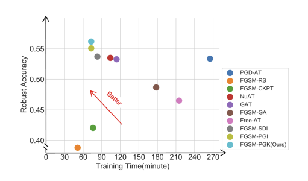

<h1 align='center' style="text-align:center; font-weight:bold; font-size:2.0em;letter-spacing:2.0px;">
                Improving fast adversarial training with prior-guided knowledge (TPAMI2024)</h1>
<p align='left' style="text-align:left;font-size:1.2em;">
<b>
    [<a href="https://ieeexplore.ieee.org/abstract/document/10478545/" target="_blank" style="text-decoration: none;">Project Page</a>] |
    [<a href="https://arxiv.org/pdf/2304.00202.pdf" target="_blank" style="text-decoration: none;">arXiv</a>] &nbsp;
</b>
</p>

## Introduction
<div style="text-align: center">

</div>
<p align="center">
PGD-10 accuracy and training time of various fast adversarial
training methods with ResNet18 as the backbone on the CIFAR-10 dateset. The x-axis represents training time (lower values indicate higher
efficiency) and the y-axis represents PGD-10 accuracy (higher values
indicate greater robustness). 
</p>


> Fast adversarial training (FAT) is an efficient method to improve robustness. However, the original FAT suffers from catastrophic overfitting, which dramatically and suddenly reduces robustness after a few training epochs. Although various FAT variants have been proposed to prevent overfitting, they require high training costs. In this paper, we investigate the relationship between adversarial example quality and catastrophic overfitting by comparing the training processes of standard adversarial training and FAT. We find that catastrophic overfitting occurs when the attack success rate of adversarial examples becomes worse. Based on this observation, we propose a positive prior-guided adversarial initialization to prevent overfitting by improving adversarial example quality without extra training costs. This initialization is generated by using high-quality adversarial perturbations from the historical training process. We provide theoretical analysis for the proposed initialization and propose a prior-guided regularization method that boosts the smoothness of the loss function. Additionally, we design a prior-guided ensemble FAT method that averages the different model weights of historical models using different decay rates. Our proposed method, called FGSM-PGK, assembles the prior-guided knowledge, i.e., the prior-guided initialization and model weights, acquired during the historical training process. Evaluations of four datasets demonstrate the superiority of the proposed method.
## Requirements

- Platform: Linux
- Hardware: V100
- pytorch, etc.

## Train
```
python3.6 FGSM_PGK_CIFAR10.py  --out_dir ./output/ --data-dir cifar-data
```

## Test
```
python3.6 test_cifar10.py --model_path model.pth --out_dir ./output/ --data-dir cifar-data
```

## Trained Models
> The Trained models come soon